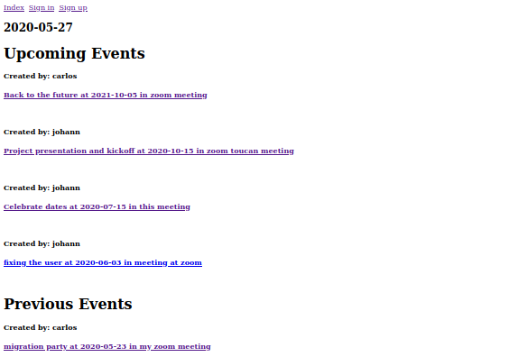

# Project private events

# Description

> This is an online applications which allows to create events, see them and invite other users to them, you can have your user and see your events and the events you are attending to.

## Built With

- Ruby on rails
- Vscode
- Atom

## Requisites

- Ruby on rails 5.2.4.2
- Ruby 2.6.5

## Getting Started

- You can clone this repository locally by using: git@github.com:JohannRodriguez/private-events.git
- To use it, first get into the repository folder on your terminal and use the command "rails db:migrate".
- Then type "rails server"
- Go to your browser and type http://localhost:3000 to see the page.

## Authors

👤 **Johann Rodríguez**
- Github: [@JohannRodriguez](https://github.com/JohannRodriguez)
- Twitter: [@BSapce](https://https://twitter.com/BSapce)
- Linkedin: [Johann Rodríguez](https://www.linkedin.com/in/johann-alonso-rodr%C3%ADguez-v%C3%A1zquez-25b07719a/)

👤 **Carlos Prieto**
- Github: [@carlosprietobarron](https://github.com/carlosprietobarron)
- Linkedin: [Carlos Prieto](https://www.linkedin.com/in/carlos-prieto-41a2b018b/)
- Email: [Carlos Prieto Barrón](carloprietobarron@gmail.com)

## 🤝 Contributing

Contributions, issues and feature requests are welcome!

Feel free to check the [issues page](https://github.com/JohannRodriguez/private-events/issues).

## Show your support

Give a ⭐️ if you like this project!

## Acknowledgments

- The odin project

## 📝 License

This project is [MIT](lic.url) licensed.
